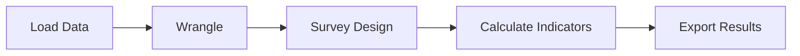

# StatsKita Architecture Documentation

## TL;DR

**What StatsKita Does:**
- 🚀 Loads BPS survey data (SAKERNAS, SUSENAS, PODES) efficiently with Polars backend
- 📊 Applies complex survey corrections (weights, strata, PSUs) automatically
- 🎯 Calculates official indicators (labour force participation, unemployment rate, etc.) with one function call
- 💾 Exports to Stata/Excel/Parquet with metadata preserved
- 🐍 Works seamlessly with pandas/polars DataFrames

## How It Works

